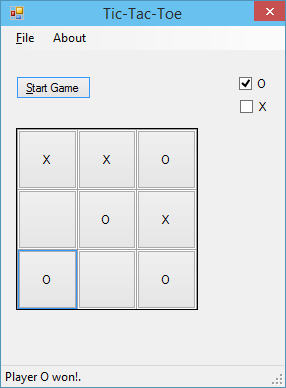

Tic Tac Toe 게임을 간단하게 윈도우 응용프로그램으로 구현하였습니다.

Tic-tac-toe 게임은 [wiki](http://en.wikipedia.org/wiki/Tic-tac-toe)에 소개되어 있는 것과 같이 가로 3, 세로 3개으로 이루어진 칸에 두명이 번갈아 가며 한 칸씩 차지해서 먼저 연속된 3칸을 차지하는 사람이 이기는 게임입니다.
가로, 세로 혹은 대각선으로 연속된 3칸을 차지하면 됩니다.

응용프로그램을 실행하고 내가 사용할 표시를 결정한 후 Start Game 버튼을 클릭하면 게임이 시작됩니다.

O 를 선택한 경우 선공입니다. 만약 두명이 번갈아가며 게임을 진행하려면 O, X 모두 선택하고 Start Game 버튼을 클릭하면 됩니다.

먼저 연속된 3칸을 차지하게 되면 게임은 종료됩니다. 혹은 9칸을 모두 사용하였는데 승패를 결정지을 수 없으면 비기는 게임이 됩니다.

File > Statistics 메뉴를 선택하면 현재까지 진행한 게임수, 승리 및 비긴 게임의 수를 확인할 수 있습니다.

[Github: Tic-tac-toe](https://github.com/bbonkr/Tic-tac-toe)
