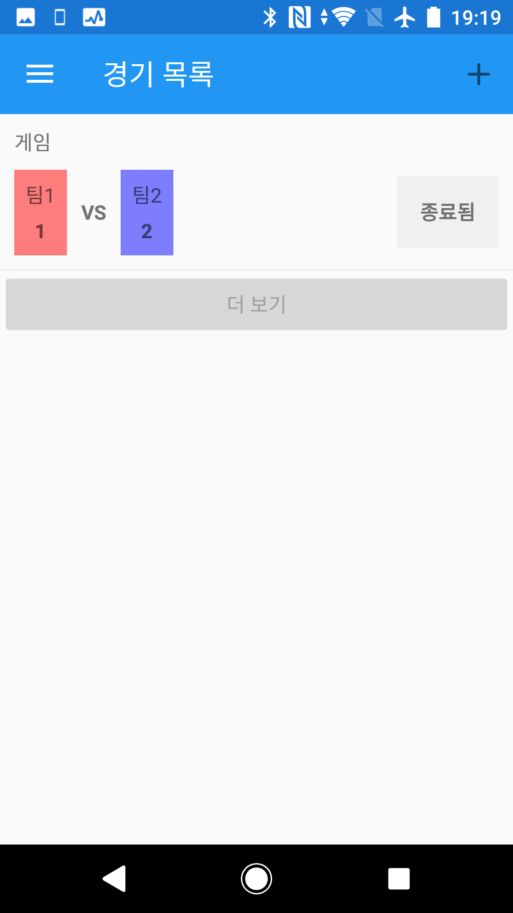
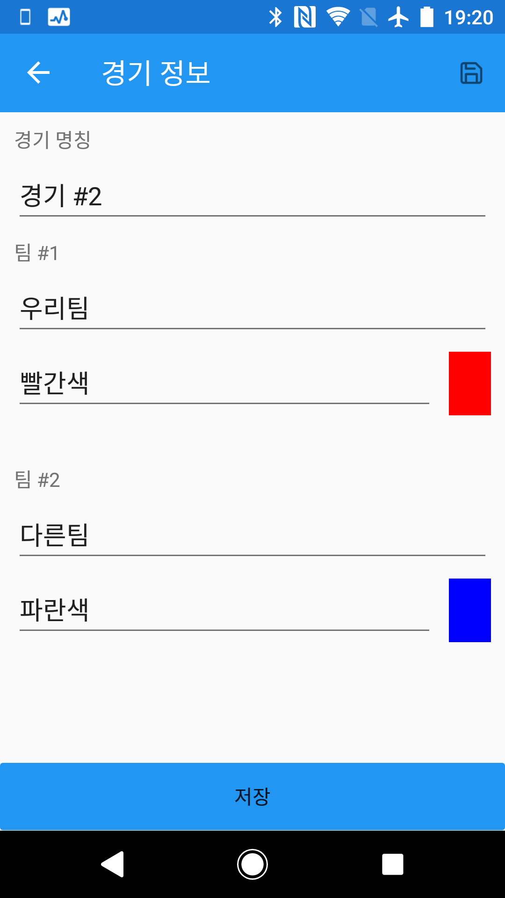
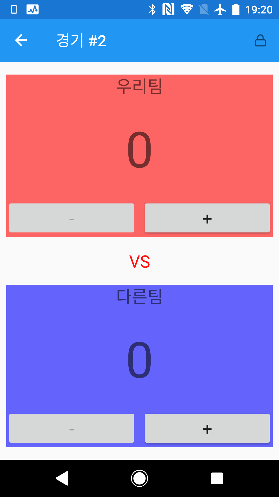

경기 점수를 어디에서나 편리하게 기록하는 것을 지원하기 위한 응용프로그램입니다.

축구 동호회, 탁구 동호회 등 1점씩 득점을 처리하는 경기에 최적화 되어 있습니다.

모든 기능을 무료로 사용하세요. 😃

## 다운로드

[@Google Play](https://play.google.com/store/apps/details?id=kr.bbon.ScoreBoard&pcampaignid=MKT-Other-global-all-co-prtnr-py-PartBadge-Mar2515-1)

[@Microsoft Store](https://www.microsoft.com/store/apps/9P7VPGXBGPWJ?cid=storebadge&ocid=badge)

## 사용법

### 경기 목록

지금까지 기록한 경기 목록입니다.

### 경기 추가

오른쪽 위에 있는 ➕ 버튼을 탭하면 경기 정보를 입력해서 항목을 추가할 수 있습니다.

### 점수판

팀 별로 ➕ 버튼을 탭하면 점수가 1 증가하고, ➖ 버튼을 탭하면 점수가 1 감소합니다.

점수의 최소값은 0이며 0보다 작은 점수는 입력할 수 없습니다.

