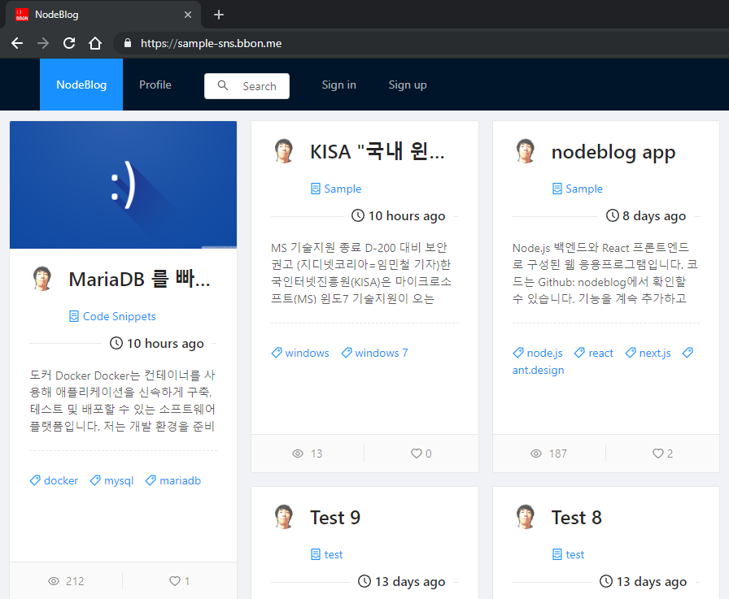

Node.js 백엔드와 React 프론트엔드로 작성된 블로깅 서비스 앱입니다.

## 기술 스택 <small>Technology stack</small>

### Node.js

#### Express

[Express](https://expressjs.com/)는 Node.js에서 사용되는 웹 응용프로그램 작성을 위한 프레임워크입니다.

프론트엔드에서 데이터를 요청할 API를 제공하는 웹앱이 작성되어 있습니다.

#### Passport

[Passport](http://www.passportjs.org/)는 Node.js에서 사용되는 인증 프레임워크입니다.

이번 프로젝트에서는 정의된 모델을 사용하는 로컬 인증을 사용합니다.

#### Sequelize

[Sequelize](http://docs.sequelizejs.com/)는 프로미스 기반의 Node.js ORM <small>Object-relational mapping</small> 입니다.

이번 프로젝트의 데이터베이스관리시스템 <small>DBMS</small>은 MariaDB를 사용합니다.

### React

[React](https://reactjs.org/)는 [페이스북](https://www.facebook.com/react)에서 [오픈소스](https://github.com/facebook/react)로 개발을 진행중인 사용자 인터페이스 <small>UI, User Interface</small> 작성을 위한 자바스크립트 라이브러리입니다.

이번 프로젝트에서는 가능하면 컴포넌트를 클래스를 선언하지 않고 함수 컴포넌트만으로 작성하고, 훅 <small>Hook</small>으로 상태 <small>State</small>관리 및 React 기능을 사용하는 것이 목표입니다.

#### Next.js

[Next.js](https://nextjs.org)는 React 를 사용해서 싱글 페이지 응용프로그램 <small>SPA Single Page Application</small> 을 작성하고, 검색엔진최적화 <small>SEO Search Engine Optimaizaion</small>을 위해 서버 사이드 렌더링 <small>SSR Server Side Rendering</small>과 파일 시스템 기반 라우팅, 자동 코드 스플릿팅 등 많은 기능을 제공해주는 프레임워크입니다.

#### React Redux

[React Redux](https://react-redux.js.org/)는 Redux 저장소의 데이터를 읽고, 저장소의 작업을 보내 데이터를 업데이트하는 형식으로 상태를 관리할 수 있습니다.

React Hook을 지원해서 (`useSelector`, `useDispatch`) 함수형 컴포넌트에서도 문제없이 사용할 수 있습니다.

#### Redux-Saga

[Redux-Saga](https://redux-saga.js.org/)로 Redux 작업을 비동기로 처리합니다.

[제너레이터 Generator](https://developer.mozilla.org/en-US/docs/Web/JavaScript/Guide/Iterators_and_Generators)로 비동기 처리를 구현한 것이 매우 흥미롭습니다.

#### styled components

[styled-components](https://www.styled-components.com/)는 컴포넌트 작성 때 인라인 스타일로 적용하면 코드 가독성이 나빠지고, 속성의 이름을 css와 다르게 작성해야하는 점을 해결해 줍니다.

컴포넌트 코드 파일에 인라인 스타일을 적용할 수 밖에 없을 때에 사용합니다.

#### Ant Design

React 로 사용자 인터페이스를 구성하기 위한 컴포넌트 작성시 어떻게 보여줄 것인가를 생각하는 것은 생각보다 시간이 많이 걸립니다.

작은 프로젝트를 혼자 진행할 때에는 더욱 시간이 많이 걸립니다. 이럴 때 전문가의 도움을 받으면 시간을 많이 절약할 수 있습니다.

이 프로젝트에서는 전반적으로 Ant Design 팀의 디자인 가이드 라인을 따르며 컴포넌트 디자인을 사용했습니다.

### Docker

응용프로그램을 게시하기 위해서 도커 이미지를 작성하고, 개인적으로 사용중인 시놀로지 디스크 스테이션에서 도커 컨테이너를 실행하고 있습니다.

[데모 사이트](https://sample-sns.bbon.me)에서 동작을 확인할 수 있습니다.

## 회고

약 한달간 프로젝트를 진행하며 React에 재미를 붙였습니다.

의존성으로 추가되어 사용중인 패키지는 대부분 사용 방법에 대한 문서가 잘 제공되어 큰 문제없이 진행되었습니다.

그 중 가장 시간이 많이 걸렸던 부분은 Next.js 구성에 포함된 Webpack 에 대한 부분이었습니다.
시간이 많이 걸리며 구성을 변경하고, 확인을 진행하다 보니 대부분 Next.js 에서 기본값으로 구성해 놓은 것들이었습니다.
그래서, 거의 구성 코드가 없습니다.

ORM 으로 사용된 Sequelize는 기능을 너무 많이 제공해서 어렵게 느껴지는 부분이 많았습니다.

next.js는 아주 편리한 프레임워크로 생각됩니다.
그리고, 정적 파일 생성 기능을 제공(`next export`)해서 간단한 페이지 작성시 자주 사용할 것 같습니다.

코드는 [GitHub](https://github.com/bbonkr/nodeblog)에서 확인할 수 있습니다.
