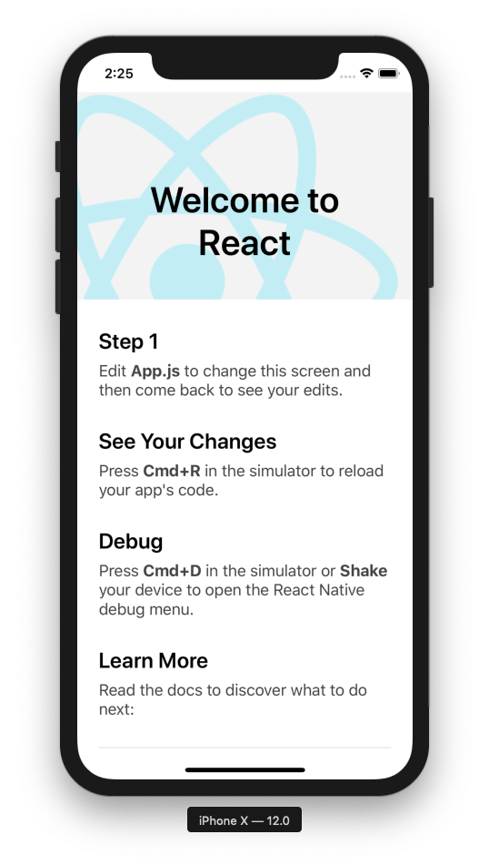

[React Native Getting Started](https://facebook.github.io/react-native/docs/getting-started) 페이지의 내용을 따라하면서 발생한 문제들입니다.

-   시작하기 정말? #1 👈
-   [시작하기 정말? #2](../react-native-get-started-really-2)
-   [시작하기 정말? #3](../react-native-get-started-really-3)

기본적인 설치 및 구성은 페이지를 보며 진행했습니다.

저의 환경은 macOS 10.14.5 입니다.

Expo 는 사용하지 않고, React Native CLI 로 프로젝트를 스캐폴딩했습니다.

Node, XCode, Android Studio 가 설치되어 있습니다.

-   Node v11.7.0
-   npm v6.5.0
-   Xcode v10.2.1 (10E1001), XCode command line tools installed
-   Android Studio v3.4, Android SDK installed

Xamarin 으로 작성된 모바일 응용프로그램을 React Native 로 재작성하기 위해 프로젝트를 만들었습니다.

```bash
$ react-native init ScoreBoard
```

보통은 스캐폴딩된 프로젝트가 바로 실행이 가능하니, 바로 실행해 봤습니다.

```bash
$ react-native run-ios
info Found Xcode project "ScoreBoard.xcodeproj"
info Building (using "xcodebuild -project ScoreBoard.xcodeproj -configuration Debug -scheme ScoreBoard -destination id=83FAF3D3-6BBE-4D55-91BC-EA307C8A7F81 -derivedDataPath build/ScoreBoard")
.................
error Failed to build iOS project. We ran "xcodebuild" command but it exited with error code 65. To debug build logs further, consider building your app with Xcode.app, by opening ScoreBoard.xcodeproj. Run CLI with --verbose flag for more details.
User defaults from command line:
    IDEDerivedDataPathOverride = /Users/bbon/Repos/scoreboard-rn/ScoreBoard/ios/build/ScoreBoard

note: Using new build system
note: Planning build
note: Using build description from disk
PhaseScriptExecution Start\ Packager /Users/bbon/Repos/scoreboard-rn/ScoreBoard/ios/build/ScoreBoard/Build/Intermediates.noindex/ScoreBoard.build/Debug-iphonesimulator/ScoreBoard.build/Script-FD10A7F022414F080027D42C.sh (in target: ScoreBoard)
    cd /Users/bbon/Repos/scoreboard-rn/ScoreBoard/ios
    /bin/sh -c /Users/bbon/Repos/scoreboard-rn/ScoreBoard/ios/build/ScoreBoard/Build/Intermediates.noindex/ScoreBoard.build/Debug-iphonesimulator/ScoreBoard.build/Script-FD10A7F022414F080027D42C.sh

CompileC /Users/bbon/Repos/scoreboard-rn/ScoreBoard/ios/build/ScoreBoard/Build/Intermediates.noindex/ScoreBoard.build/Debug-iphonesimulator/ScoreBoard.build/Objects-normal/x86_64/main.o /Users/bbon/Repos/scoreboard-rn/ScoreBoard/ios/ScoreBoard/main.m normal x86_64 objective-c com.apple.compilers.llvm.clang.1_0.compiler (in target: ScoreBoard)
    cd /Users/bbon/Repos/scoreboard-rn/ScoreBoard/ios
    export LANG=en_US.US-ASCII
    /Applications/Xcode.app/Contents/Developer/Toolchains/XcodeDefault.xctoolchain/usr/bin/clang -x objective-c -arch x86_64 -fmessage-length=0 -fdiagnostics-show-note-include-stack -fmacro-backtrace-limit=0 -std=gnu99 -fobjc-arc -fmodules -gmodules -fmodules-cache-path=/Users/bbon/Repos/scoreboard-rn/ScoreBoard/ios/build/ScoreBoard/ModuleCache.noindex -fmodules-prune-interval=86400 -fmodules-prune-after=345600 -fbuild-session-file=/Users/bbon/Repos/scoreboard-rn/ScoreBoard/ios/build/ScoreBoard/ModuleCache.noindex/Session.modulevalidation -fmodules-validate-once-per-build-session -Wnon-modular-include-in-framework-module -Werror=non-modular-include-in-framework-module -Wno-trigraphs -fpascal-strings -O0 -fno-common -Wno-missing-field-initializers -Wno-missing-prototypes -Werror=return-type -Wunreachable-code -Wno-implicit-atomic-properties -Werror=deprecated-objc-isa-usage -Wno-objc-interface-ivars -Werror=objc-root-class -Wno-arc-repeated-use-of-weak -Wimplicit-retain-self -Wduplicate-method-match -Wno-missing-braces -Wparentheses -Wswitch -Wunused-function -Wno-unused-label -Wno-unused-parameter -Wunused-variable -Wunused-value -Wempty-body -Wuninitialized -Wconditional-uninitialized -Wno-unknown-pragmas -Wno-shadow -Wno-four-char-constants -Wno-conversion -Wconstant-conversion -Wint-conversion -Wbool-conversion -Wenum-conversion -Wno-float-conversion -Wnon-literal-null-conversion -Wobjc-literal-conversion -Wshorten-64-to-32 -Wpointer-sign -Wno-newline-eof -Wno-selector -Wno-strict-selector-match -Wundeclared-selector -Wdeprecated-implementations -DDEBUG=1 -DOBJC_OLD_DISPATCH_PROTOTYPES=0 -isysroot /Applications/Xcode.app/Contents/Developer/Platforms/iPhoneSimulator.platform/Developer/SDKs/iPhoneSimulator12.2.sdk -fasm-blocks -fstrict-aliasing -Wprotocol -Wdeprecated-declarations -mios-simulator-version-min=9.0 -g -Wno-sign-conversion -Winfinite-recursion -Wcomma -Wblock-capture-autoreleasing -Wstrict-prototypes -Wno-semicolon-before-method-body -fobjc-abi-version=2 -fobjc-legacy-dispatch -index-store-path /Users/bbon/Repos/scoreboard-rn/ScoreBoard/ios/build/ScoreBoard/Index/DataStore -iquote /Users/bbon/Repos/scoreboard-rn/ScoreBoard/ios/build/ScoreBoard/Build/Intermediates.noindex/ScoreBoard.build/Debug-iphonesimulator/ScoreBoard.build/ScoreBoard-generated-files.hmap -I/Users/bbon/Repos/scoreboard-rn/ScoreBoard/ios/build/ScoreBoard/Build/Intermediates.noindex/ScoreBoard.build/Debug-iphonesimulator/ScoreBoard.build/ScoreBoard-own-target-headers.hmap -I/Users/bbon/Repos/scoreboard-rn/ScoreBoard/ios/build/ScoreBoard/Build/Intermediates.noindex/ScoreBoard.build/Debug-iphonesimulator/ScoreBoard.build/ScoreBoard-all-target-headers.hmap -iquote /Users/bbon/Repos/scoreboard-rn/ScoreBoard/ios/build/ScoreBoard/Build/Intermediates.noindex/ScoreBoard.build/Debug-iphonesimulator/ScoreBoard.build/ScoreBoard-project-headers.hmap -I/Users/bbon/Repos/scoreboard-rn/ScoreBoard/ios/build/ScoreBoard/Build/Products/Debug-iphonesimulator/include -I/Users/bbon/Repos/scoreboard-rn/ScoreBoard/ios/build/ScoreBoard/Build/Intermediates.noindex/ScoreBoard.build/Debug-iphonesimulator/ScoreBoard.build/DerivedSources-normal/x86_64 -I/Users/bbon/Repos/scoreboard-rn/ScoreBoard/ios/build/ScoreBoard/Build/Intermediates.noindex/ScoreBoard.build/Debug-iphonesimulator/ScoreBoard.build/DerivedSources/x86_64 -I/Users/bbon/Repos/scoreboard-rn/ScoreBoard/ios/build/ScoreBoard/Build/Intermediates.noindex/ScoreBoard.build/Debug-iphonesimulator/ScoreBoard.build/DerivedSources -F/Users/bbon/Repos/scoreboard-rn/ScoreBoard/ios/build/ScoreBoard/Build/Products/Debug-iphonesimulator -MMD -MT dependencies -MF /Users/bbon/Repos/scoreboard-rn/ScoreBoard/ios/build/ScoreBoard/Build/Intermediates.noindex/ScoreBoard.build/Debug-iphonesimulator/ScoreBoard.build/Objects-normal/x86_64/main.d --serialize-diagnostics /Users/bbon/Repos/scoreboard-rn/ScoreBoard/ios/build/ScoreBoard/Build/Intermediates.noindex/ScoreBoard.build/Debug-iphonesimulator/ScoreBoard.build/Objects-normal/x86_64/main.dia -c /Users/bbon/Repos/scoreboard-rn/ScoreBoard/ios/ScoreBoard/main.m -o /Users/bbon/Repos/scoreboard-rn/ScoreBoard/ios/build/ScoreBoard/Build/Intermediates.noindex/ScoreBoard.build/Debug-iphonesimulator/ScoreBoard.build/Objects-normal/x86_64/main.o
In file included from /Users/bbon/Repos/scoreboard-rn/ScoreBoard/ios/ScoreBoard/main.m:10:
/Users/bbon/Repos/scoreboard-rn/ScoreBoard/ios/ScoreBoard/AppDelegate.h:8:9: fatal error:
'React/RCTBridgeDelegate.h' file not found
#import <React/RCTBridgeDelegate.h>

        ^~~~~~~~~~~~~~~~~~~~~~~~~~~

1
 error generated.

CompileC /Users/bbon/Repos/scoreboard-rn/ScoreBoard/ios/build/ScoreBoard/Build/Intermediates.noindex/ScoreBoard.build/Debug-iphonesimulator/ScoreBoard.build/Objects-normal/x86_64/AppDelegate.o /Users/bbon/Repos/scoreboard-rn/ScoreBoard/ios/ScoreBoard/AppDelegate.m normal x86_64 objective-c com.apple.compilers.llvm.clang.1_0.compiler (in target: ScoreBoard)
    cd /Users/bbon/Repos/scoreboard-rn/ScoreBoard/ios
    export LANG=en_US.US-ASCII
    /Applications/Xcode.app/Contents/Developer/Toolchains/XcodeDefault.xctoolchain/usr/bin/clang -x objective-c -arch x86_64 -fmessage-length=0 -fdiagnostics-show-note-include-stack -fmacro-backtrace-limit=0 -std=gnu99 -fobjc-arc -fmodules -gmodules -fmodules-cache-path=/Users/bbon/Repos/scoreboard-rn/ScoreBoard/ios/build/ScoreBoard/ModuleCache.noindex -fmodules-prune-interval=86400 -fmodules-prune-after=345600 -fbuild-session-file=/Users/bbon/Repos/scoreboard-rn/ScoreBoard/ios/build/ScoreBoard/ModuleCache.noindex/Session.modulevalidation -fmodules-validate-once-per-build-session -Wnon-modular-include-in-framework-module -Werror=non-modular-include-in-framework-module -Wno-trigraphs -fpascal-strings -O0 -fno-common -Wno-missing-field-initializers -Wno-missing-prototypes -Werror=return-type -Wunreachable-code -Wno-implicit-atomic-properties -Werror=deprecated-objc-isa-usage -Wno-objc-interface-ivars -Werror=objc-root-class -Wno-arc-repeated-use-of-weak -Wimplicit-retain-self -Wduplicate-method-match -Wno-missing-braces -Wparentheses -Wswitch -Wunused-function -Wno-unused-label -Wno-unused-parameter -Wunused-variable -Wunused-value -Wempty-body -Wuninitialized -Wconditional-uninitialized -Wno-unknown-pragmas -Wno-shadow -Wno-four-char-constants -Wno-conversion -Wconstant-conversion -Wint-conversion -Wbool-conversion -Wenum-conversion -Wno-float-conversion -Wnon-literal-null-conversion -Wobjc-literal-conversion -Wshorten-64-to-32 -Wpointer-sign -Wno-newline-eof -Wno-selector -Wno-strict-selector-match -Wundeclared-selector -Wdeprecated-implementations -DDEBUG=1 -DOBJC_OLD_DISPATCH_PROTOTYPES=0 -isysroot /Applications/Xcode.app/Contents/Developer/Platforms/iPhoneSimulator.platform/Developer/SDKs/iPhoneSimulator12.2.sdk -fasm-blocks -fstrict-aliasing -Wprotocol -Wdeprecated-declarations -mios-simulator-version-min=9.0 -g -Wno-sign-conversion -Winfinite-recursion -Wcomma -Wblock-capture-autoreleasing -Wstrict-prototypes -Wno-semicolon-before-method-body -fobjc-abi-version=2 -fobjc-legacy-dispatch -index-store-path /Users/bbon/Repos/scoreboard-rn/ScoreBoard/ios/build/ScoreBoard/Index/DataStore -iquote /Users/bbon/Repos/scoreboard-rn/ScoreBoard/ios/build/ScoreBoard/Build/Intermediates.noindex/ScoreBoard.build/Debug-iphonesimulator/ScoreBoard.build/ScoreBoard-generated-files.hmap -I/Users/bbon/Repos/scoreboard-rn/ScoreBoard/ios/build/ScoreBoard/Build/Intermediates.noindex/ScoreBoard.build/Debug-iphonesimulator/ScoreBoard.build/ScoreBoard-own-target-headers.hmap -I/Users/bbon/Repos/scoreboard-rn/ScoreBoard/ios/build/ScoreBoard/Build/Intermediates.noindex/ScoreBoard.build/Debug-iphonesimulator/ScoreBoard.build/ScoreBoard-all-target-headers.hmap -iquote /Users/bbon/Repos/scoreboard-rn/ScoreBoard/ios/build/ScoreBoard/Build/Intermediates.noindex/ScoreBoard.build/Debug-iphonesimulator/ScoreBoard.build/ScoreBoard-project-headers.hmap -I/Users/bbon/Repos/scoreboard-rn/ScoreBoard/ios/build/ScoreBoard/Build/Products/Debug-iphonesimulator/include -I/Users/bbon/Repos/scoreboard-rn/ScoreBoard/ios/build/ScoreBoard/Build/Intermediates.noindex/ScoreBoard.build/Debug-iphonesimulator/ScoreBoard.build/DerivedSources-normal/x86_64 -I/Users/bbon/Repos/scoreboard-rn/ScoreBoard/ios/build/ScoreBoard/Build/Intermediates.noindex/ScoreBoard.build/Debug-iphonesimulator/ScoreBoard.build/DerivedSources/x86_64 -I/Users/bbon/Repos/scoreboard-rn/ScoreBoard/ios/build/ScoreBoard/Build/Intermediates.noindex/ScoreBoard.build/Debug-iphonesimulator/ScoreBoard.build/DerivedSources -F/Users/bbon/Repos/scoreboard-rn/ScoreBoard/ios/build/ScoreBoard/Build/Products/Debug-iphonesimulator -MMD -MT dependencies -MF /Users/bbon/Repos/scoreboard-rn/ScoreBoard/ios/build/ScoreBoard/Build/Intermediates.noindex/ScoreBoard.build/Debug-iphonesimulator/ScoreBoard.build/Objects-normal/x86_64/AppDelegate.d --serialize-diagnostics /Users/bbon/Repos/scoreboard-rn/ScoreBoard/ios/build/ScoreBoard/Build/Intermediates.noindex/ScoreBoard.build/Debug-iphonesimulator/ScoreBoard.build/Objects-normal/x86_64/AppDelegate.dia -c /Users/bbon/Repos/scoreboard-rn/ScoreBoard/ios/ScoreBoard/AppDelegate.m -o /Users/bbon/Repos/scoreboard-rn/ScoreBoard/ios/build/ScoreBoard/Build/Intermediates.noindex/ScoreBoard.build/Debug-iphonesimulator/ScoreBoard.build/Objects-normal/x86_64/AppDelegate.o
In file included from /Users/bbon/Repos/scoreboard-rn/ScoreBoard/ios/ScoreBoard/AppDelegate.m:8:
/Users/bbon/Repos/scoreboard-rn/ScoreBoard/ios/ScoreBoard/AppDelegate.h:8:9: fatal error: 'React/RCTBridgeDelegate.h' file not found
#import <React/RCTBridgeDelegate.h>
        ^~~~~~~~~~~~~~~~~~~~~~~~~~~
1 error generated.


** BUILD FAILED **


The following build commands failed:
	CompileC /Users/bbon/Repos/scoreboard-rn/ScoreBoard/ios/build/ScoreBoard/Build/Intermediates.noindex/ScoreBoard.build/Debug-iphonesimulator/ScoreBoard.build/Objects-normal/x86_64/main.o /Users/bbon/Repos/scoreboard-rn/ScoreBoard/ios/ScoreBoard/main.m normal x86_64 objective-c com.apple.compilers.llvm.clang.1_0.compiler
(1 failure)
```

예상과 다르게 빌드가 실패합니다.

[iOS 프로젝트의 의존 패키지 설치가 없어서 실패했다는 내용](https://github.com/getsentry/sentry-react-native/issues/395)을 확인합니다.

필요한 [cocoapods](https://cocoapods.org/) 패키지 관리자가 없습니다.

homebrew 로 cocoapods 설치합니다.

```bash
$ brew install cocoapods
```

iOS 프로젝트 디렉터리로 이동해서 의존 패키지를 내려받아 설치합니다.

```bash
$ cd ios
$ pod install
```

다시 실행하면 정상적으로 실행됩니다.

```bash
$ cd ..
$ react-native run-ios
```



## 주의

문제를 해결하기 위해 참고한 깃허브 이슈 페이지의 내용에는 iOS 프로젝트에서 `pod install` 명령으로 설치하는 것을 지양해야 한다고 이야기합니다.
차후 다시 확인해봐야겠습니다.
