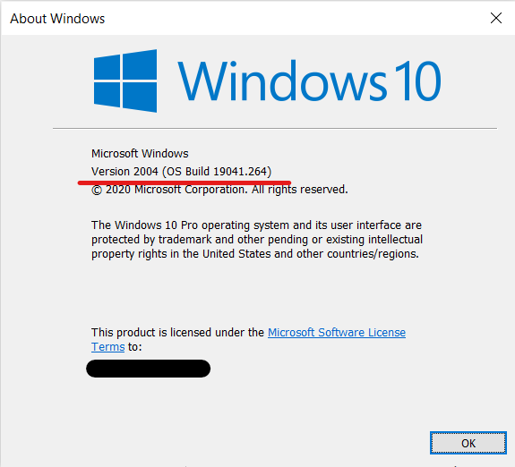
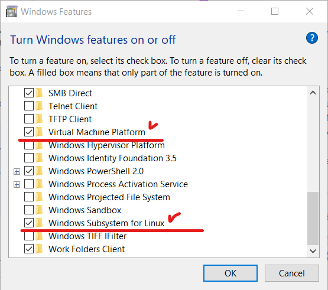
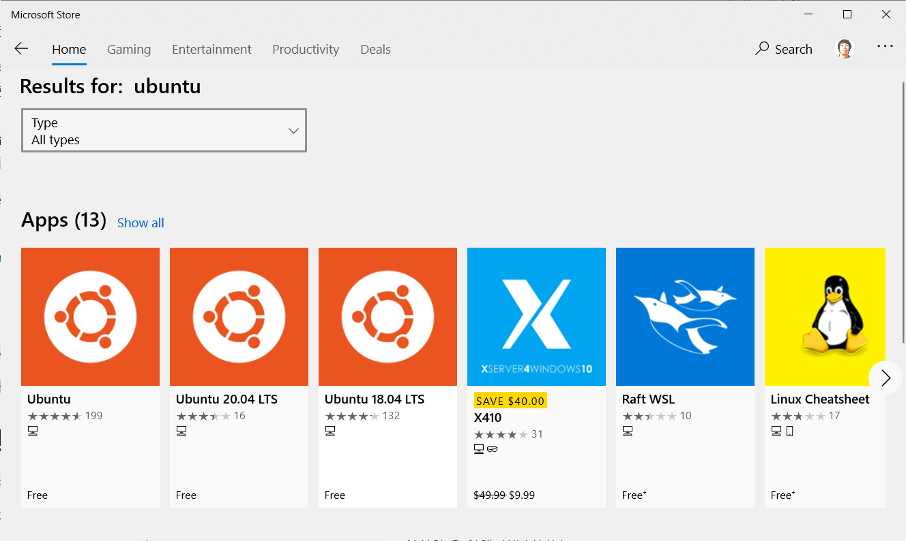

최근 게시된 Windows 10 Build 2004 는 WSL 2 버전<small>Windows Subsystem Linux version 2</small>이 포함되어 있습니다.




WSL 2 버전은 Linux용 Windows 하위 시스템 아키텍쳐의 새로운 버전입니다.

WSL 2 버전은 파일 시스템 성능을 높이고, 전체 시스템 호출 호환성을 추가합니다.

WSL 2 버전은 WSL 1버전을 대체하지 않으므로, 리눅스 배포반을 사용할 때, WSL 2 버전 또는 WSL 1 버전을 선택적으로 지정할 수 있습니다.

## WSL 사용

WSL 을 사용하려면 아래 두 Windows 기능을 사용하도록 변경되어야 합니다.

기능 이름: 가상 머신 플랫폼 Virtual Machine Platform

```powershell
PS> Enable-WindowsOptionalFeature -Online -FeatureName VirtualMachinePlatform
```

기능 이름: Linux용 Windows 하위 시스템 Windows Subsystem for Linux

```powershell
PS> Enable-WindowsOptionalFeature -Online -FeatureName Microsoft-Windows-Subsystem-Linux
```




## 리눅스 배포판 설치

리눅스 배포판의 설치 방법은 여러 가지가 제공됩니다.

가장 쉬운 방법은 Windows Store 에서 리눅스 배포판을 검색하고, 설치하는 방법입니다.

예를 들어 리눅스 배포판중 Ubuntu를 사용하려면 Windows Store 에서 Ubuntu를 검색하고, 원하는 버전을 설치한 후 실행하면 됩니다.



리눅스 배포판이 설치된 후 실행하면 리눅스에서 사용할 사용자 이름, 비밀번호를 입력하는 창이 열리고, 원하는 사용자 이름, 비밀번호를 입력한 후 사용하시면 됩니다.

## WSL 1 버전 사용자

WSL 1 버전으로 리눅스 배포판을 사용중이면, WSL 1 버전을 계속 사용해도 되고, WSL 2 버전으로 변경할 수도 있습니다.

`wsl -l -v` 명령으로 현재 실행중인 배포판 목록을 확인할 수 있습니다.

배포판 이름, 상태, WSL 버전이 출력됩니다.

```powershell
PS> wsl -l -v
  NAME            STATE           VERSION
* Ubuntu-20.04    Running         2
```

WSL 2 버전으로 변경하려면 `wsl --set-version <distribution name> <version>` 명령으로 배포판을 실행할 WSL 버전을 지정할 수 있습니다.

예를 들어 배포판 이름이 Ubuntu-20.04 이고 WSL 1 버전으로 실행 중인 리눅스 배포판을 WSL 2 버전으로 실행되도록 변경하려면 아래와 같이 명령을 실행합니다.

```powershell
PS> wsl --set-version Ubuntu-20.04 2
```

WSL 2 버전로 실행중인 배포판을 WSL 1 버전으로 변경할 수도 있습니다.

```powershell
PS> wsl --set-versoin Ubuntu-20.04 1
```

## ❗ WSL 버전 변경 동작안함

저는 WSL 1 버전을 사용했었고, 글 작성 당시에는 WSL 1 버전을 사용하지 않게 설정되어 있는 상태였습니다.

WSL 2 버전사용을 위해 Windows 기능을 활성화하고, 리눅스 배포판을 설치한 후 WSL 2 버전으로 변경을 시도했는데, 처리되는 것 같지 았았습니다.
`wsl --set-version Ubuntu-20.04 2` 명령 실행 후 금방 종료되어 버렸습니다.

WSL 배포판 목록을 확인해 보니, 여전히 WSL 1 버전으로 출력됩니다.

관련 문제를 검색해보니, [WSL 2 리눅스 커널 업데이트](https://docs.microsoft.com/ko-kr/windows/wsl/wsl2-kernel) 페이지를 확인하고, x64 장치용 최신 WSL 2 리눅스 커널 업데이트 패키지를 다운로드하고 설치했습니다.

x64 장치용 최신 WSL 2 리눅스 커널 업데이트 패키지 설치 후 다시 WSL 2 버전으로 변경을 시도하니 시간이 조금 흐른 후 종료되었습니다.

WSL 배포판 목록을 확인해보니, WSL 2 버전으로 실행중임을 확인할 수 있었습니다.

```powershell
PS> wsl --set-version Ubuntu-20.04 2
Conversion in progress, this may take a few minutes...
For information on key differences with WSL 2 please visit https://aka.ms/wsl2
Conversion complete.
PS> wsl -l -v
 NAME            STATE           VERSION
* Ubuntu-20.04    Stopped         2
 Debian          Stopped         1
 Ubuntu          Stopped         2
```

## 마치며

리눅스에서 윈도우 파일 시스템으로 관리되는 Git 로컬 저장소의 파일 처리는 WSL 1 버전에 비해 빨라졌지만, 느립니다. 💦

Windows 사용자 디렉터리와 WSL 사용자 디렉터리는 분리되어 있습니다.

Windows 에서 WSL 사용자 디렉터리에 접근하려면 `\\wsl$\<distribution name>\home\<linux username>`와 같이 네트워크 경로를 사용해서 접근할 수 있습니다. 👏

예를 들어 배포판 이름이 `Ubuntu-20.04` 이고, 리눅스 사용자 이름이 `bbon`이면, 연결 경로는 아래와 같습니다.

🙌 `\\wsl$\Ubuntu-20.04\home\bbon`

윈도우에서 사용하는 Visual Studio Code 에 [Remote -WSL 확장](https://code.visualstudio.com/blogs/2019/09/03/wsl2)을 설치한 후 리눅스에서 Visual Studio Code를 실행 `$ code .` 하면, Visual Studio Code Server 가 시작되고, 윈도우에서 리눅스의 파일시스템에 원격으로 연결해서 작업이 가능합니다. 👍

```bash
$ code .
Installing VS Code Server for x64 (0000000000000000000000000000000000000000)
Downloading: 100%
Unpacking: 100%
Unpacked 2321 files and folders to /home/bbon/.vscode-server/bin/0000000000000000000000000000000000000000.
```

리눅스 배포판을 연결하려면 명령 프롬프트를 열고, `bash` 명령을 실행하면 기본 리눅스 배포판이 연결됩니다.

리눅스 배포판을 연결하려면 명령 프롬프트를 열고, `bash` 명령을 실행하면 기본 리눅스 배포판이 연결됩니다.

```powershell
PS> bash
```

## 참조

-   [Linux용 Windows 하위 시스템 설명서](https://docs.microsoft.com/ko-kr/windows/wsl/)
-   [WSL 2 Linux 커널 업데이트](https://docs.microsoft.com/ko-kr/windows/wsl/wsl2-kernel)

