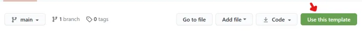

## GitHub 템플릿 사용

GitHub 에서 저장소를 작성할 때, 템플릿으로 표시된 저장소를 사용해서 내 저장소를 작성할 수 있습니다.

## 템플릿

SPA 를 시작하려면 구현하려는 프레임워크뿐만 아니라 트랜스파일, 번들링 등 신경써야 하는 부분이 많습니다.

React 를 처음 시작하시는 분들을 위해서, React 구현에 집중하실 수 있게 템플릿을 작성했습니다.

React Starter Kit 에서 저장소를 작성하시려면 [GitHub: React Starter Kit](https://github.com/bbonkr/react-starter-kit) 페이지로 이동한 후 `Use this template` 버튼을 클릭해서 본인의 저장소를 만드세요.

작성된 본인의 저장소를 로컬에 복제한 후 React 프레임워크에 집중해서 시작하실 수 있습니다.

## 설명

스타터 킷은 typescript 로 작성할 수 있게 구성되어 있습니다.

webpack 으로 트랜스파일과 번들링이 구성되어 있습니다.

개발환경으로 webpack-dev-server를 사용하고, HMR <small>Hot Module Replacement</small>가 준비되어 있습니다.

## 시작

원격 저장소를 로컬 저장소로 복제하고, 터미널에서 `npm run dev` 명령으로 개발서버를 시작합니다.

웹 브라우저에서 `http://localhost:3000` 을 탐색하면, 현재 작성된 코드가 렌더링 됩니다.

이 상태에서 컴포넌트를 작성하고, 라우트를 추가해서 구현한 코드를 바로 웹 브라우저에서 확인할 수 있습니다.

## 나중에

React 프레임워크가 익숙해지면, webpack 도 익혀보시길 권장합니다.

## 관련 링크

-   [GitHub: React Starter Kit](https://github.com/bbonkr/react-starter-kit)
-   [GitHub](https://github.com)
-   [React](https://ko.reactjs.org)
-   [Typescript](https://www.typescriptlang.org)
-   [webpack](https://webpack.js.org)
-   [webpack dev server](https://webpack.js.org/configuration/dev-server)
-   [Hot Module Replacement](https://webpack.js.org/guides/hot-module-replacement)
-   [npm](https://docs.npmjs.com)
-   [git](https://git-scm.com)
-   [GitHub: Creating a template repository](https://docs.github.com/en/free-pro-team@latest/github/creating-cloning-and-archiving-repositories/creating-a-template-repository)
