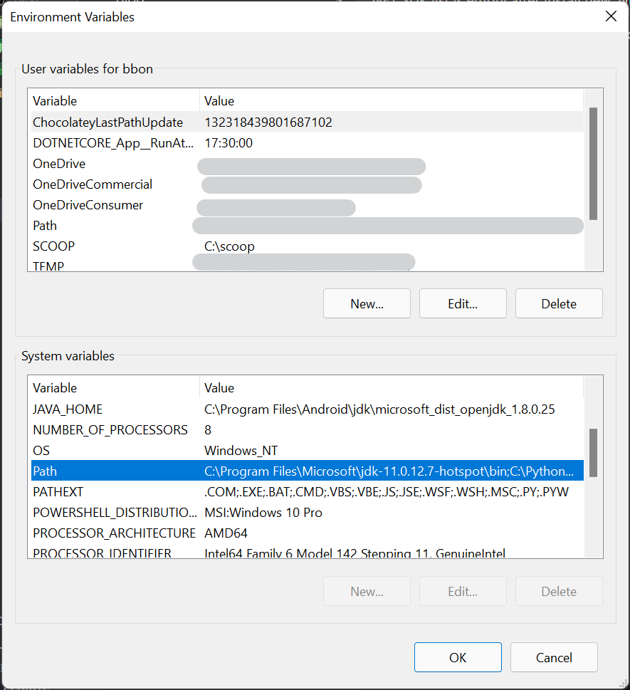
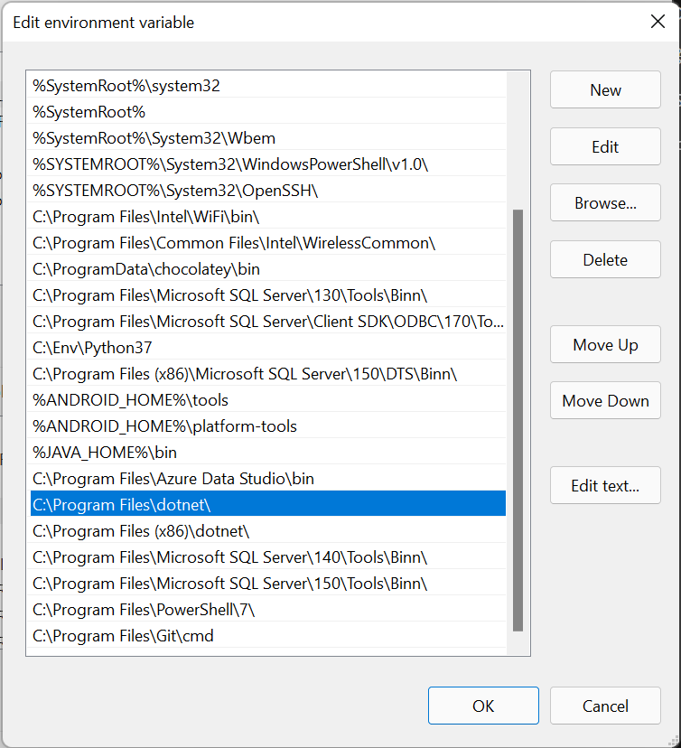

---
title: .NET SDK를 설치한 후 .NET SDK 목록이 비어 있습니다
date: 2021-11-09
categories: 
  - "blog"
  - "computing"
tags: 
  - "net"
  - "dotnet"
  - "troubleshooting"
---    

# .NET SDK list is empty after install new .NET SDK

[.NET 6](https://dotnet.microsoft.com/download)이(가) 출시되었습니다.

.NET SDK 설치파일을 다운로드한 후 실행해서 SDK 를 설치할 수 있습니다.

그런데, 아래 명령으로 설치된 SDK 목록을 조회하면, 설치된 SDK 목록이 비어있습니다.

```bash
$ dotnet --list-sdks
```

## 문제 해결

이전부터 가끔발생하는 문제로 시스템 환경변수 `PATH` 에서 .NET SDK 설치 디렉터리의 순서를 변경하면 됩니다.

> Windows 11 에서 시스템 환경변수 편집을 찾으시려면 검색버튼을 클릭하고 아래 키워드로 빠르게 실행할 수 있습니다. 검색어: `system variables`



대상 디렉터리는 아래와 같습니다.

> `C:\Program Files\dotnet\` 경로가 `C:\Program Files (x86)\dotnet\` 경로보다 위쪽에 존재하도록 순서를 조정하면 됩니다.

- `C:\Program Files\dotnet\`
- `C:\Program Files (x86)\dotnet\`

> 목록에서 순서를 조정할 항목을 선택한 후 오른쪽 위로 버튼 또는 아래로 버튼으로 순서를 조정할 수 있습니다.



## SDK 목록 확인

터미널을 다시 열고 SDK 목록을 조회하면 정상적으로 설치된 SDK 목록이 출력됩니다.

```bash
$ dotnet --list-sdks
2.1.816 [C:\Program Files\dotnet\sdk]
2.2.207 [C:\Program Files\dotnet\sdk]
3.1.301 [C:\Program Files\dotnet\sdk]
3.1.414 [C:\Program Files\dotnet\sdk]
5.0.100 [C:\Program Files\dotnet\sdk]
5.0.103 [C:\Program Files\dotnet\sdk]
5.0.104 [C:\Program Files\dotnet\sdk]
5.0.203 [C:\Program Files\dotnet\sdk]
5.0.208 [C:\Program Files\dotnet\sdk]
5.0.302 [C:\Program Files\dotnet\sdk]
5.0.402 [C:\Program Files\dotnet\sdk]
6.0.100 [C:\Program Files\dotnet\sdk]
```
