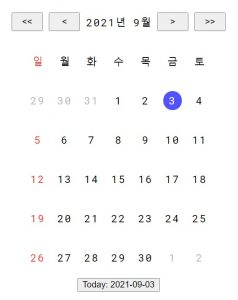

---
title: NPM @bbon/react-calendar package
date: 2021-12-14
categories: 
  - "blog"
  - "computing"
  - "repository"
tags: 
  - "github"
  - "github-repository"
  - "npm"
  - "react"
  - "typescript"
github: # If you want to show github buttons, fill owner and repo
  owner:  bbonkr
  repo: react-calendar
---    

[](https://www.npmjs.com/package/@bbon/react-calendar) [](https://www.npmjs.com/package/@bbon/react-calendar) [](https://github.com/bbonkr/react-calendar/actions/workflows/build-and-tag.yml) [](https://github.com/bbonkr/react-calendar/actions/workflows/publish-npm.yml)

타입스크립트로 작성된 리액트 달력 컴포넌트입니다.

## peer dependencies

- react [NPM](https://www.npmjs.com/package/react) [GitHub](https://github.com/facebook/react)
- react-dom [NPM](https://www.npmjs.com/package/react-dom) [GitHub](https://github.com/facebook/react)
- dayjs [NPM](https://www.npmjs.com/package/dayjs) [GitHub](https://github.com/iamkun/dayjs)

## 설치

```bash
$ npm install --save @bbon/react-calendar
```

## 사용

```typescript
import React, { useCallback } from 'react';
import { Calendar } from '@bbon/react-calendar';

import '@bbon/react-calendar/dist/calendar.css';

const MyComponent = () => {

    const handleChangeSelection = useCallback(
        (start?: string, end?: string) => {
            console.info('Selected dates: ', start, end);
        },
        [],
    );

    return (
        <div>
            <Calendar
                useMoveToYear
                useMoveToMonth
                highlightToday
                showDate
                onChange={handleChangeSelection}
            />
        </div>
    );
}
```



## 모양

`@bbon/react-calendar/dist/calendar.css` 파일의 내용을 확인하고, 스타일을 재정의해서 사용하실 수 있습니다.

## 시연

[bbon.me: react-calendar](https://bbon.me/react-calendar) 로 이동해서 동작을 확인하실 수 있습니다.

## 번들러

[Webpack](https://webpack.js.org) 에서 [Rollup](https://rollupjs.org/) 으로 변경했습니다.

변경사유는 아래와 같습니다.

- 트리쉐이킹 (Tree-shaking) 지원
- CommonJS 모듈과 ES 모듈을 모두 제공

