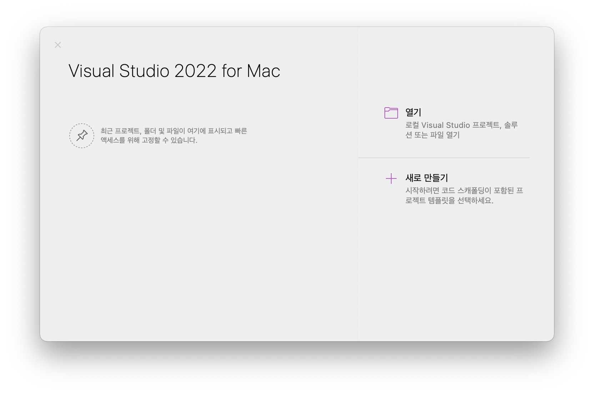
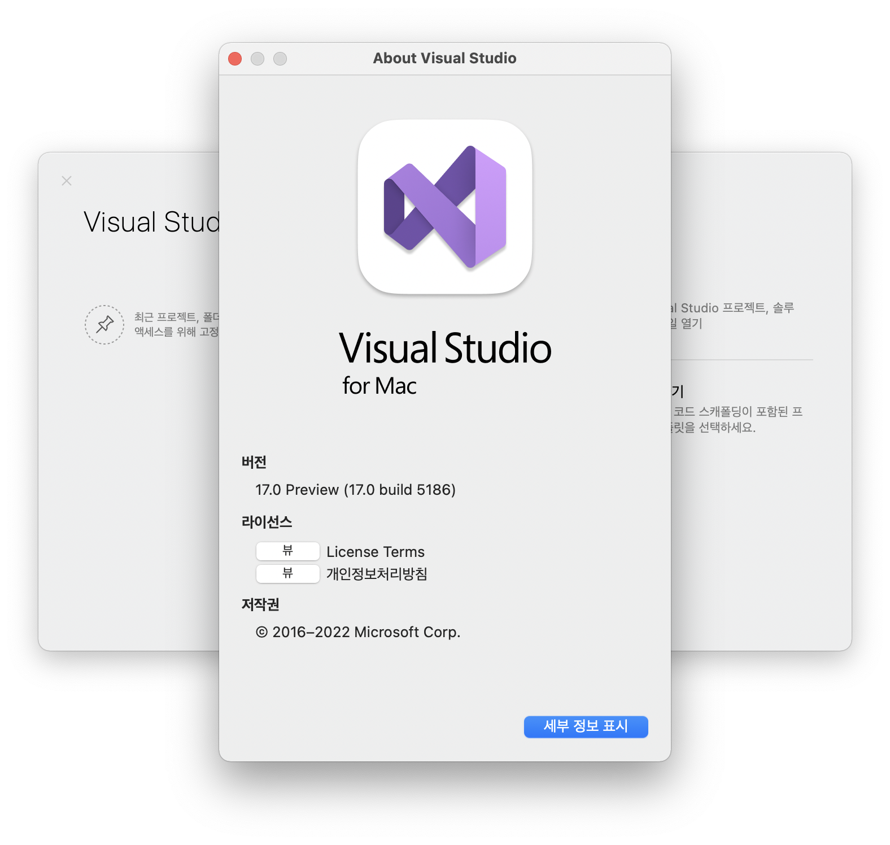

---
title: MacBook onboarding for development
date: 2022-01-15
categories: 
  - "blog"
  - "computing"
  - "howto"
tags: 
  - "net"
  - "backend"
  - "developer"
  - "frontend"
  - "macbook"
  - "macos"
  - "node-js"
  - "onboarding"
  - "react"
  - "visual-studio"
  - "visual-studio-code"
---    


MacBook 을 구입하고, 계속 작업을 할 수 있게 환경을 구성하면서, 진행한 내용을 기록합니다.

> 혹시나 비슷하게 구성하시는 분이 참조하실 수 있기 바랍니다.

## For General use

### Homebrew

Macos 패키지 관리자 [Homebrew](https://brew.sh/) 를 설치합니다.

> [v3.0.0](https://brew.sh/2021/02/05/homebrew-3.0.0/) 이후부터 애플실리콘(M1)을 지원합니다.

### Git

MacOS 에 설치되어 있는 git 은 보통 최신 빌드가 아니므로, 버젼확인 후 Homebrew를 사용해서 git을 설치합니다.

```bash
$ git --version
```

git 은 기본 설치 응용프로그램 목록에서 제외된 것으로 확인됩니다.

터미널에서 git 명령을 입력하면 다운로드하는 기능의 실행을 묻습니다.

homebrew로 git 최신빌드를 설치합니다.

```bash
$ brew install git
```

```bash
$ git --version 
git version 2.32.0 (Apple Git-132)
```

## for React frontent development

> node.js 기반 개발환경이 필요한 경우에 해당합니다.

### nvm

NVM (Node version manager) 은 node.js 설치를 매우 편리하게 사용할 수 있는 도구입니다.

저는 편리하게 사용자 권한으로 node.js 설치가 가능해서 우선적으로 설치를 고려합니다.

Homebrew 에서 제공하는 패키지로 nvm 을 설치합니다.

```bash
$ brew install nvm
# 생략
You should create NVM's working directory if it doesn't exist:

  mkdir ~/.nvm

Add the following to ~/.zshrc or your desired shell
configuration file:

  export NVM_DIR="$HOME/.nvm"
  [ -s "/opt/homebrew/opt/nvm/nvm.sh" ] && \. "/opt/homebrew/opt/nvm/nvm.sh"  # This loads nvm
  [ -s "/opt/homebrew/opt/nvm/etc/bash_completion.d/nvm" ] && \. "/opt/homebrew/opt/nvm/etc/bash_completion.d/nvm"  # This loads nvm bash_completion

You can set $NVM_DIR to any location, but leaving it unchanged from
/opt/homebrew/opt/nvm will destroy any nvm-installed Node installations
upon upgrade/reinstall.
```

nvm 설치 스크립트 마지막에 출력되는 내용을 확인하고 설명대로 따라합니다.

```bash
# 사용자 프로필 디렉터리에 .nvm 디렉터리를 작성합니다.
$ mkdir ~/.nvm
```

.zshrc 파일을 편집기로 열어서 내용을 추가합니다.

```bash
# ZSH 사용자 프로필을 편집기로 편집합니다.
$ nano ~/.zshrc
```

마지막 줄에 해당 내용을 붙여넣습니다.

> PATH 환경변수에 .nvm 경로를 추가하고, nvm 사용을 준비하는 명령입니다.

```plaintext
export NVM_DIR="$HOME/.nvm"
[ -s "/opt/homebrew/opt/nvm/nvm.sh" ] && \. "/opt/homebrew/opt/nvm/nvm.sh"  # This loads nvm
[ -s "/opt/homebrew/opt/nvm/etc/bash_completion.d/nvm" ] && \. "/opt/homebrew/opt/nvm/etc/bash_completion.d/nvm"  # This loads nvm bash_completion
```

아래 명력으로 쉘 프로필을 다시 로드합니다.

```bash
$ source ~/.zshrc
```

설치된 NVM 버젼을 확인합니다.

```bash
$ nvm --version
0.39.1
```

아래 명령으로 최신 LTS 빌드를 설치합니다.

```bash
$ nvm install --lts
```

설치된 node.js 버젼을 확인합니다.

```bash
$ node --version
v16.13.2
```

설치된 node.js 가 애플 실리콘용 바이너리인지 확인합니다.

```bash
$ node -p "process.arch"
arm64
```

- \[x\] 애플실리콘으로 실행되는 바이너리가 설치되었는지 확인

### Visual Studio Code

[Visual Studio Code](https://code.visualstudio.com/)는 React 개발시 주로 사용하는 Microsoft 에서 제공하는 IDE 입니다.

> [v1.54](https://code.visualstudio.com/updates/v1_54) 이후부터 애플 실리콘을 지원합니다.

Visual Studio Code 실행 후 커맨트 팔레트를 열고 (Command ⌘ + Shift ⇧ + p) 아래 메뉴를 실행해서 터미널에서 실행할 수 있게 구성합니다.

```plaintext
>shell command: Install 'code' command in PATH
```

이 후 터미널에서 아래 명령으로 Visual Studio Code를 실행한 후 현재 디렉터리를 열수 있습니다.

```bash
$ cd path-to-work
$ code .
```

> 관련글: [Start Visual Studio Code on Terminal on MacOS](https://bbon.kr/start-visual-studio-code-on-terminal-on-macos/)

## for .NET development

### .NET SDK

[.NET 6](https://dotnet.microsoft.com/en-us/download/dotnet/6.0) 부터 애플 실리콘용 SDK가 제공됩니다.

### Visual Studio 2022

프리뷰 단계의 [Visual Studio 2022 for Mac](https://visualstudio.microsoft.com/ko/vs/mac/preview/) (을)를 제공하고 있습니다.

설치해보니 설치 직후 Visual Studio 2022 라고 제목이 출력되었는데, 업데이트 후 Visual studio 2019 for Mac 으로 변경되었습니다.

제거 후 다시 설치를 진행할 예정입니다. 진행했습니다.

다시 설치한 직후 확인한 응용프로그램 정보입니다.





## Docker

개발용 서버를 실행해야 하는 경우에 필요하다고 생각됩니다.

설치한 후 필요할 때에만 실행하는 것을 목적으로 합니다.

> 웹서버, 웹 응용프로그램, 데이터베이스 서버를 컨테이너로 실행해서 확인이 필요한 경우에 활용합니다.

[Docker Desktop](https://www.docker.com/products/docker-desktop) 페이지에서 설치 파일을 얻을 수 있습니다.

애플 실리콘용 바이너리가 제공되므로, `Mac with Apple Chip` 링크를 클릭해서 다운로드해서 사용합니다.

> Docker Desktop 사용에 관한 약관을 확인하셔야 합니다. 개인적 용도로 사용할 때는 제약이 없을 것 같은데, 업무용으로 사용한다면 직원이 250명 미만이고 연간 매출이 1천만 달러 미만인 경우에만 무료로 사용할 수 있습니다. It remains free for small businesses (fewer than 250 employees AND less than $10 million in annual revenue), personal use, education, and non-commercial open source projects.

이미지를 내려받을 때에도 해당 프로젝트가 arm64용 이미지를 제공하는지 확인하고, 가능하면 arm64용 이미지를 내려받으면 성능상 이점이 있을 것 같습니다.

그런데, arm64용 이미지를 제공하는 프로젝트는 잘 보이지 않습니다.

linux/amd64 용 이미지를 내려받아서 사용해도 크게 문제가 발생하는 경우는 없다고 합니다.

> 아직 관련 이슈가 없지만, 이슈가 발생하면 해결방법을 열심히 찾아봐야 합니다.

```bash
$ docker --version
Docker version 20.10.11, build dea9396
$ docker-compose --version
Docker Compose version v2.2.1
```

## Local database

개발용 로컬 데이터베이스를 사용하기 위해 도커를 활용합니다.

Windows 에서는 Visual Studio 설치시 사용할 수 있는 로컬 데이터베이스가 있어 매우 편리하게 사용할 수 있습니다.

Macos 에는 지원되지 않으므로 작업시 컨테이너를 실행해서 비슷하게 사용할 수 있습니다.

SQL Server 엔진이 필요한 경우 SQL server 2019 이미지를 사용하면 될 것으로 생각했습니다.

SQL Server 2019 amd64 이미지의 경우 애플 실리콘에서 컨테이너 실행이 불가능한 것으로 확인됩니다.

> SQL Server 2019 도커 이미지로 컨테이너를 작성할 때, 마운트된 볼륨에 쓰기 권한 문제가 있는 것으로 확인됩니다. 이 문제인지는 차후 확인할 계획입니다.

그래서, Azure SQL Edge 를 활용합니다.

Azure SQL Edge 는 IoT 장치의 데이터를 저장하는 데 특화된 관계형 데이터베이스입니다.

SQL Server와 동일하게 동작하는 관계형 데이터베이스이면 개발에 활용할 수 있으므로 Azure SQL Edge 이미지를 사용해서 컨테이너를 실행하면 될 것으로 생각됩니다.

### Azure SQL Edge docker-compose

```yaml
version: '3'

services:
  azuresqledge:
    image: mcr.microsoft.com/azure-sql-edge:latest
    container_name: azuresqledge
    # restart: always
    ports:
      - "1433:1433"
    environment:
      - ACCEPT_EULA=Y
      - MSSQL_SA_PASSWORD=your-password
      - MSSQL_TELEMETRY_ENABLED=FALSE
      - TZ=Asia/Seoul
    volumes:
      - ./mssql:/var/opt/mssql
    network_mode: bridge
```

컨테이너 실행 후 [Azure Data Studio](https://docs.microsoft.com/ko-kr/sql/azure-data-studio) 등의 도구로 데이터베이스를 관리하고 활용할 수 있습니다.

## 마침

> 온보딩(Onboarding)이란 용어가 맞지 않을 수 있지만, 준비단계를 거쳐 개발환경을 준비한다라는 의미로 사용했습니다.

당장 필요한 것만 준비했습니다.

추가로 필요한 사항은 필요해질 때, 천천히 구성합니다.

구성이 필요한 내용이 발생해서 응용프로그램을 다운로드하고, 설치할 때 제공되는 Mac용 바이너리가 Intel CPU 용, Apple Silicon 용으로 나눠서 제공된다면 가능하면 Apple Silicon용을 다운로드 받아서 사용할 계획입니다.

