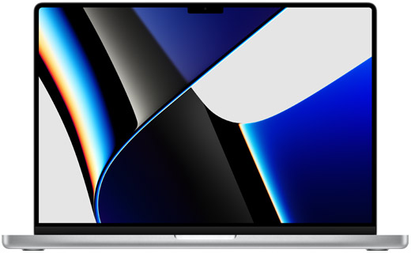
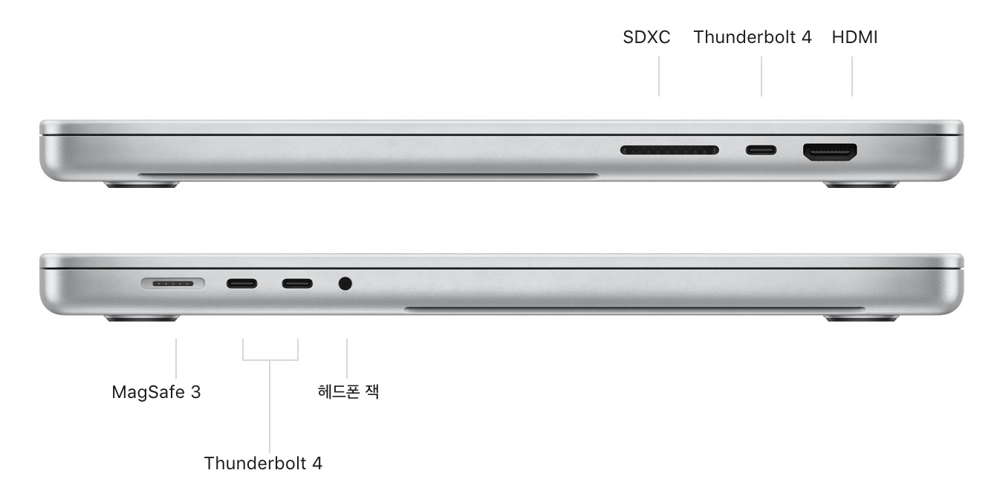

---
title: MacBook Pro 2021 16-inch M1 Max
date: 2022-01-15
categories: 
  - "blog"
  - "computing"
  - "story"
tags: 
  - "apple"
  - "apple-m1"
  - "laptop"
  - "m1"
  - "m1-max"
  - "mac"
  - "macbook-pro"
  - "macos"
  - "맥북"
  - "애플"
featuredImage: ./macbook-pro-2021-16-inch-m1-max-006.jpg
---    

많은 고민 후 새로운 장치를 구입했습니다.

MacBook Pro 16형, 2021년, 16인치 M1 맥스 SoC가 탑재되어 있는 모델을 구입했습니다.

## 주문

2021-12-18 주문하고, 2022-01-11 배송이 완료되었습니다.

## 사양

> 제품 사양은 [MacBook Pro 14형 및 16형 - 제품사양](https://www.apple.com/kr/macbook-pro-14-and-16/specs/) 페이지에서 발췌한 내용이며, 첨부된 이미지도 동일한 페이지에서 제공되고 있는 이미지를 사용합니다.

### 칩

Apple M1 Max - 10코어 CPU(성능 코어 8개 및 효율 코어 2개) - 32코어 GPU - 16코어 Neural Engine - 400GB/s 메모리 대역폭

미디어 엔진 - 하드웨어 가속형 H.264, HEVC, ProRes, ProRes RAW - 동영상 디코딩 엔진 - 동영상 인코딩 엔진 2개 - ProRes 인코딩 및 디코딩 엔진 2개

### 디스플레이

Liquid Retina XDR 디스플레이 - 16.2형(41.05cm, 대각선) Liquid Retina XDR 디스플레이,10 3456 x 2234 기본 해상도(254ppi)

### 메모리

32GB 통합 메모리

### 배터리 및 전원

100 WH 배터리가 내장되고, 140W 전원 어댑터, USB-C-MagSafe 3 케이블이 제공됩니다.

- Apple TV 앱 동영상 재상 최대 21시간
- 무선 인터넷 사용 최대 14시간
- 100와트시 리튬 폴리머 배터리
- 140W USB-C 전원 어댑터
- USB-C-MagSafe 3 케이블
- 기본 포함된 140W USB-C 전원 어댑터로 급속 충전 가능

### 저장장치

1TB SSD

### 충전 및 확장

- SDXC 카드 슬롯
- HDMI 포트
- 3.5mm 헤드폰 잭
- MagSafe 3 포트
- 다음을 지원하는 Thunderbolt 4(USB-C) 포트 3개:
    
    - 충전
    - DisplayPort
    - Thunderbolt 4(최대 40Gb/s)
    - USB 4(최대 40Gb/s)

### 비디오 지원

10억 색상 및 하드웨어 최대 해상도 상태의 내장 디스플레이와 동시에 다음 사양의 외부 디스플레이 지원: - 10억 개 이상의 색상으로 60Hz에서 최대 6K 해상도를 구현하는 외장 디스플레이 최대 2대(M1 Pro 모델) 또는 10억 개 이상의 색상으로 60Hz에서 최대 6K 해상도를 구현하는 외장 디스플레이 최대 3대 및 60Hz에서 최대 4K 해상도를 구현하는 외장 디스플레이 1대(M1 Max 모델)

Thunderbolt 4 디지털 비디오 출력 - USB‑C를 통한 기본 DisplayPort 출력 - 어댑터를 통해 VGA, HDMI, DVI, Thunderbolt 2 출력 지원(어댑터 별매)

HDMI 디지털 비디오 출력 - 60Hz에서 최대 4K 해상도 디스플레이 1대 지원 - HDMI-DVI 어댑터를 통한 DVI 출력(어댑터 별매)

### 키보드 및 트랙패드

백라이트 Magic Keyboard:

- 풀사이즈 기능키 12개 및 역 T자 배열의 방향키 4개를 포함한 78키 키보드(ANSI)
- Touch ID
- 주변광 센서
- 정확한 커서 제어 및 압력 감지 기능을 위한 Force Touch 트랙패드:
    
    - 세게 클릭, 가속도계, 압력 감지를 이용한 그리기, Multi-Touch 제스처 지원

### 무선 기술

Wi-Fi - 802.11ax Wi-Fi 6 무선 네트워크 - IEEE 802.11a/b/g/n/ac 호환

Bluetooth - Bluetooth 5.0 무선 기술

### 카메라

- 1080p FaceTime HD 카메라
- 컴퓨테이셔널 비디오 기술을 갖춘 첨단 이미지 신호 프로세서

### 오디오

- 포스 캔슬링 우퍼를 탑재한 하이파이 6 스피커 사운드 시스템
- 와이드 스테레오 사운드
- 내장 스피커로 Dolby Atmos 방식의 음악 또는 동영상 재생 시 공간 음향 지원
- AirPods(3세대), AirPods Pro, AirPods Max 사용 시 동적 머리 추적 기술로 구현되는 공간 음향
- 높은 신호 대 잡음비와 지향성 빔포밍을 자랑하는 스튜디오급 3 마이크 어레이
- 하이 임피던스 헤드폰을 고급 지원하는 3.5mm 헤드폰 잭

### 크기 및 무게

두께: 1.68cm

가로: 35.57cm

세로: 24.81cm

무게: 2.2kg

## 사용기

기존 사용하던 장치(Lenovo ThinkPad T490)와 비교한 내용입니다.

> [Lenovo ThinkPad T490](https://bbon.kr/lenovo-thinkpad-t490/) 페이지에서 기존 사용하던 장치를 확인하실 수 있습니다.

### 개발환경

OS 가 변경되었음에도 Visual Studio Code 의 사용 경험은 동일합니다.

이전 장비와 다른점은 **빠르다** 입니다.

프론트엔드 개발시 사용하는 번들링도 빠르고, 코드 작성시 자동완성 추천도 매우 빠르게 동작합니다.

조금 더 빠르게 작업을 처리할 수 있을 것으로 생각됩니다.

불편한 점은 주 사용 IDE 중 하나인 Visual Studio 2022 의 Mac 용 도구입니다.

사용해보신 분은 아시겠지만 Windows 에서의 경험과는 차이가 있습니다.

그리고, 개발시 자주 사용하던 LocalDB 기능을 사용하지 못합니다.

Docker로 컨테이너를 실행해서 대체하던지, 다른 방법으로 데이터베이스 서버를 실행해야만 합니다.

Visual Studio 2022 for Mac 의 경우 아직 미리보기 단계이므로, 조금 더 익숙해지려고 노력해본 후 실패하면, 작은 데스크톱을 구매해서 Windows 환경에서 Visual Studio 2022 를 사용해볼 계획입니다.

### 여가

화면이 매우 훌륭합니다. (자세하게 표현할 줄 모릅니다.)

내장된 스피커로 매우 마음에 듭니다. (역시 자세하게 표현할 줄 모릅니다.)

영상보기, 음악듣기의 경험이 좋아질 것으로 생각됩니다.

### 단점

키보드가 눌러지는 깊이가 얕습니다. 손가락 마디가 충격을 받는 느낌입니다.

이전 제품에 비해 두께가 조금 두꺼워진 것으로 알고 있고, 이 변화가 키 누름 깊이에 변경이 있었으면 더 좋지 않았을까 생각합니다.

> 제가 개인적으로 느낀 단점입니다. ThinkPad를 사용하신 분이라면 비슷하게 느끼지 않을까 생각됩니다.

### 종합

보통 작업을 할 때, 굉장히 리소스를 많이 사용해가면서 진행하지는 않지만, 뭔가 리소스가 많이 남는 것 같습니다.

하지만, 부족한 것보다는 남아 있는게 마음이 편안해 집니다.

## 마침

구입비용이 매우 부담스럽지만, 구입하길 잘한 것 같습니다.

이전에 사용한 맥은 MacBook Pro (Retina, 13 inch, Early 2013) 이었습니다. 약 6년 정도 함께 열심히 일을 했었는데, 새로운 맥북도 6년 이상 잘 사용했으면 좋겠습니다.
