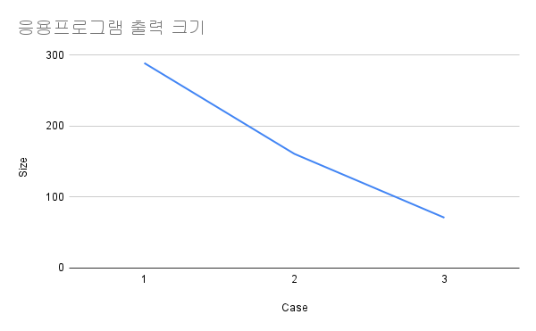
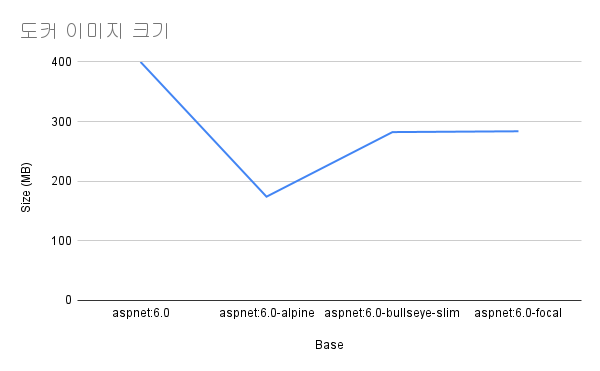

---
title: "Reduce docker image size"
date: 2022-04-14
categories:
  - computing
  - log
tags:
  - docker
  - dotnet
  - dotnet 6
  - aspnetcore 
comments: false
github:
  owner: bbonkr
  repo: bing-wallpaper
---    

[GitHub Actions 의 워크플로우](https://github.com/bbonkr/bing-wallpaper/actions/workflows/docker.yml)를 이용해서 ASP.NET Core 응용프로그램을 도커 이미지로 빌드해서 사설 도커 레지스트리에 업로드하고 있습니다. 

[GitHub: bing-wallpaper docker image workflow](https://github.com/bbonkr/bing-wallpaper/actions/workflows/docker.yml) 에서 동작을 확인하실 수 있습니다.

언젠가 부터 워크플로우가 실패하고 있었습니다.

[Merge pull request #114 from bbonkr/dev docker image #17](https://github.com/bbonkr/bing-wallpaper/actions/runs/2089159258)

오류 메시지는 아래와 같습니다.

```plaintext
buildx failed with: error: failed to solve: failed to copy: unexpected status: 413 Request Entity Too Large
```

오류 메시지를 참조해서 원인 해결을 위해 검색을 해보면 사설 도커 레지스트리 환경에서 허용 업로드 크기를 초과한 경우 발생하는 메시지로 판단됩니다.

하지만, 도커 레지스트리 실행환경에는 허용 업로드 크기를 제한하고 있지 않습니다.

nginx 허용 업로드 크기관련 구성은 아래와 같습니다.

```plaintext
http {
  client_max_body_size 0;
}
```

서버 측에서 문제를 해결할 수 없다고 생각되어 도커 이미지 크기를 줄이기로 결정했습니다.

## 확인 

### 응용프로그램 출력 크기 확인

dotnet cli 게시 명령으로 출력해서 크기를 확인해보니 아래와 같이 크기가 확인됩니다.

```bash
$ dotnet publish ./src/Bing.Wallpaper/Bing.Wallpaper.csproj -c Release -o ./test-out
```

```bash
$ du -sh ./test-out
298M	./test-out
```

생각보다 크기가 큽니다.

실행되는 환경이 linux x64 환경으로 제한되니, 출력 크기를 줄이기 위해 플랫폼을 지정해서 확인합니다.

```bash
$ dotnet publish ./src/Bing.Wallpaper/Bing.Wallpaper.csproj -c Release -o ./test-out --runtime linux-x64
```

```bash
$ du -sh ./test-out
161M	./test-out
```

dotnet cli 출력 명령 실행중 여러 경고가 출력됩니다.

그 중, --runtime 을 지정하는 경우  단일 파일로 출력할지 여부를 지정하라는 메시지가 있어, 게시 옵션을 추가합니다.

```bash
$ dotnet publish ./src/Bing.Wallpaper/Bing.Wallpaper.csproj -c Release -o ./test-out --runtime linux-x64 --no-self-contained
```

```bash
$ du -sh ./test-out
 71M	./test-out
```

298 MB 에서 71MB 로 출력 파일의 크기가 줄어들었습니다.



### 도커 이미지 빌드 확인

> Apple M1 을 사용하는 로컬 장치에 도커 데스트톱을 설치해서 임의의 버전을 태그로 지정해서 빌드해서 확인을 진행했습니다.

현재 도커 빌드 정의 파일에서 여러 단계의 빌드를 사용하고 있습니다.

base 별칭을 설정한 이미지를 변경해서 크기를 줄일 수 있을 것으로 생각됩니다.

기록해두지 않아서 정확하지 않지만,  `mcr.microsoft.com/dotnet/aspnet:6.0` 이미지를 기반으로 작성된 도커 이미지는 약 400 MB 를 초과하는 크기였습니다.

제공되는 다른 이미지로 시도합니다.

> [DockerHub: ASP.NET Core Runtime](https://hub.docker.com/_/microsoft-dotnet-aspnet) 페이지에서 제공되는 이미지를 모두 확인하실 수 있습니다.


크기가 작을 것으로 예상되는 alpine 이미지를 사용해서 빌드합니다.

```dockerfile
FROM mcr.microsoft.com/dotnet/aspnet:6.0-alpine AS base
```

```bash
$ docker build . -t bbonkr/bing-wallpaper:1.0.3 --platform linux/amd64
```

도커 이미지의 크기는 174.34 MB 입니다.

매우 많이 줄어들었습니다. 

그런데, 컨테이너 실행시 오류가 발생합니다.

오류 메시지는 아래와 같습니다.

```plaintext
Unhandled exception. System.Globalization.CultureNotFoundException: Only the invariant culture is supported in globalization-invariant mode. See https://aka.ms/GlobalizationInvariantMode for more information. (Parameter 'name')

en-us is an invalid culture identifier.
```

관련 내용을 찾아보면, apline 에서는 지역화 기능을 사용할 수 없습니다.

> [The fix: install the ICU cultures and disable Globalization Invariant Mode](https://andrewlock.net/dotnet-core-docker-and-cultures-solving-culture-issues-porting-a-net-core-app-from-windows-to-linux/#the-fix-install-the-icu-cultures-and-disable-globalization-invariant-mode)

.NET 지역화 기능을 사용할 필요가 없으면, 도커 빌드 정의에 아래 정보를 추가해서 빌드하면 됩니다.

> base 별칭이 지정된 이미지에서 아래 명령이 실행되어야 합니다.

```dockerfile
RUN apk add --no-cache icu-libs krb5-libs libgcc libintl libssl1.1 libstdc++ zlib
ENV DOTNET_SYSTEM_GLOBALIZATION_INVARIANT=false
```

메인 프로젝트 파일을 열고 아래 정보를 추가합니다.

```xml
<PropertyGroup>
  <InvariantGlobalization>false</InvariantGlobalization>
</PropertyGroup>
```

응용 프로그램에서 필요한 다른 의존 라이브러리가 있다면, 모두 찾아서 설치해야 합니다.

매우 불편합니다.

크기를 조금 더 커지더라도, 편리하게 사용하기 위해 Debian 기반 이미지로 변경합니다.

dockerfile 의 base 단계 이미지를 변경합니다.

```docker
FROM mcr.microsoft.com/dotnet/aspnet:6.0-bullseye-slim AS base
```

```bash
$ docker build . -t bbonkr/bing-wallpaper:1.0.6 --platform linux/amd64
```

도커 이미지의 크기는 282.32 MB 입니다.

컨테이너를 실행하면 정상적으로 실행됩니다.

혹시나 다른 이슈가 있으면 대응하기 위해 자주 사용하는 Ubuntu 기반 이미지로 변경합니다.

```docker
FROM mcr.microsoft.com/dotnet/aspnet:6.0-focal AS base
```

도커 이미지의 크기는 283.68 MB 입니다.

컨테이너를 실행하면 정상적으로 실행됩니다.




## 완료

작성되는 도커 이미지 크기를 조정한 후 GitHub Actions 워크플로우에서 사설 도커 레지스트리에 업로드하는 동작도 정상적으로 실행됩니다.

[](https://github.com/bbonkr/bing-wallpaper/actions/workflows/docker.yml)

