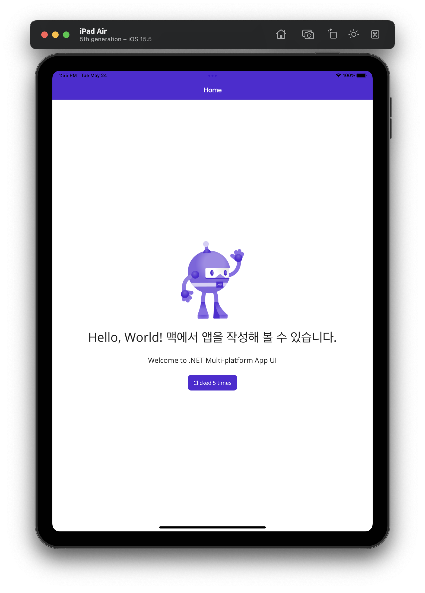

---
title: "MAUI on MacOS"
date: 2022-05-24
categories:
  - computing
  - blog
  - howto
tags:
  - dotnet
  - dotnet 6
  - maui
  - ios
  - android
  - macos
  - windows
featuredImage: 
comments: false
---    

.NET MAUI <small>Multi-platform App UI</small> 는 C#, XAML 을 사용하여 네이티브 모바일 및 데스크톱 앱을 작성하기위한 크로스플랫폼 프레임워크입니다. 

* [What is .NET MAUI](https://docs.microsoft.com/ko-kr/dotnet/maui/what-is-maui)

지원되는 네이트브 모바일 및 데스크톱은 아래와 같습니다.

* Android 5.0 (API 21) +
* iOS 10 +
* macOS 10.13 + (using Mac Catalyst)
* Windows 11
* Windows 10 version 1890 + (using Windows UI Library 3)

[Microsoft Build 2022](https://mybuild.microsoft.com/) 와 함께 여러 소식이 보여서 환경을 준비하고, 동작을 확인했습니다.

* [2022-05-23 Introducing .NET MAUI – One Codebase, Many Platforms](https://devblogs.microsoft.com/dotnet/introducing-dotnet-maui-one-codebase-many-platforms/)
* [Microsoft Build 2022 Session: Build native apps for any device with .NET and Visual Studio](https://mybuild.microsoft.com/en-US/sessions/599c82b6-0c5a-4add-9961-48b85d9ffde0)

[.NET CLI를 사용하여 Mac Catalyst 앱 빌드](https://docs.microsoft.com/ko-kr/dotnet/maui/macos/cli) 페이지의 내용을 실행한 기록입니다.

## 사전요구사항

* .NET 6 런타임이 설치되어 있어야 합니다.
* XCode 13 이 설치되어 있어야 합니다.

## 준비 

### Install XCode Command Line Tools

XCode 를 실행해서 Command Line Tools 설치를 진행합니다.

또는, 터미널에서 아래 명령으로 설치를 시작할 수 있습니다.

```bash
$ xcode-select --install
```

> 이미 설치된 경우 아래와 같은 오류 메시지가 출력됩니다.
> 
> `xcode-select: error: command line tools are already installed, use > "Software Update" to install updates`

XCode 설정창을 열고 위치 Location 탭에서 Command Line Tools 항목이 현재 설치된 버전으로 선택되어 있는지 확인하고, 비어 있으면 선택합니다.


### .NET 6

가장 최근 출시된 .NET 6 SDK 를 다운로드하고, 설치합니다.

[Download .NET 6](https://dotnet.microsoft.com/en-us/download/dotnet/6.0)

```bash
$ dotnet --verion
6.0.300
$ dotnet --list-sdks
6.0.300 [/usr/local/share/dotnet/sdk]
```

### Install .NET MAUI Workload

각 플랫폼 SDK와 .NET MAUI 를 설치합니다.

```bash
$ sudo dotnet workload install maui --source https://api.nuget.org/v3/index.json
```

> 각 플랫폼의 SDK 를 설치하는데, 미리 준비된 SDK가 있다면, 사용자가 SDK 경로를 지정할 수 있으면 좋을 것 같은데, 방법을 모르겠습니다.

## 시작

### 프로젝트 작성

```bash
$ mkdir FirstMauiApp # 프로젝트 디렉터리 작성
$ cd FirstMauiApp # 프로젝트 디렉터리로 이동
$ dotnet new maui # MAUI 프로젝트 스케폴딩
```

### 실행

Visual Studio 2022 for Mac (`17.3 Preview`) 에서 프로젝트를 열고 디버깅 시작 혹은 터미널에서 아래 명령을 실행합니다.


```bash
# FirstMauiApp directory
$ dotnet build -t:Run -f net6.0-maccatalyst
```


```bash
# FirstMauiApp directory
$ dotnet build -t:Run -f net6.0-ios
```

> [.NET CLI를 사용하여 iOS 앱 빌드](https://docs.microsoft.com/ko-kr/dotnet/maui/ios/cli) 페이지에서 특정 시뮬레이터에서 앱을 실행하는 방법을 확인할 수 있습니다. 




## 마침

XCode Command Line Tools 설치, 그 후 XCode 설정창의 위치 탭 구성만 주의하면 바로 실행할 수 있을 것이라 생각됩니다.


