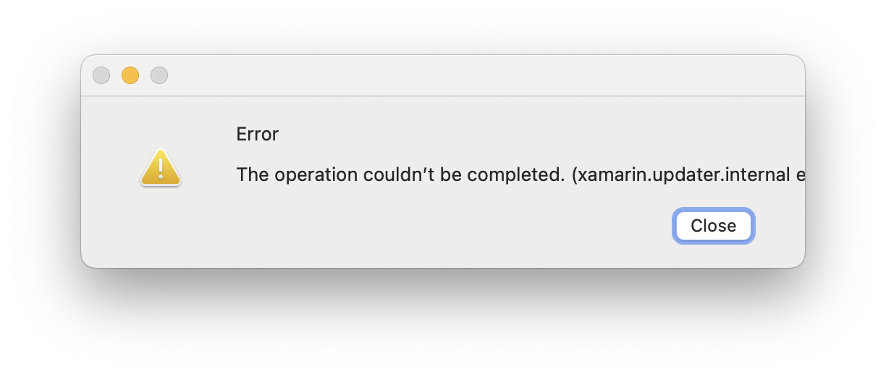
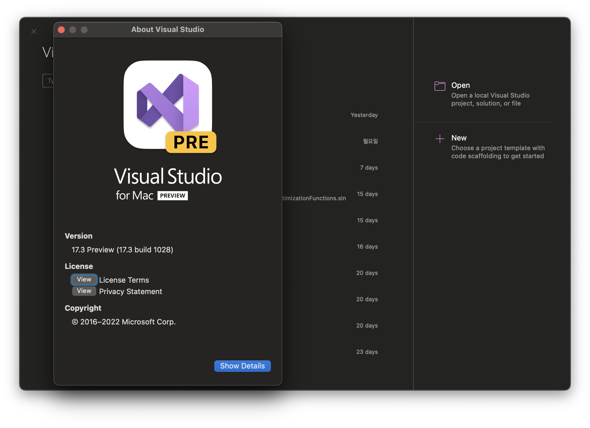

---
title: "Fail to update Visual Studio 2022 for Mac 17.3 Preview 2"
date: 2022-06-17
categories:
  - Blog
  - HowTo
  - Computing
tags:
  - Visual Studio
  - Visual Studio 2022
  - Visual Studio 2022 for Mac
  - dotnet
  - maui
featuredImage: fail-to-update-visual-studio-2022-for-mac-17-3-preview-2-02.png 
comments: false
---    

[Visual Studio 2022 for Mac 17.3 Preview 2](https://docs.microsoft.com/en-us/visualstudio/releases/2022/mac-release-notes-preview#1730-pre2--visual-studio-2022-for-mac-v173-preview-2-newreleasebutton) 업데이트에는 MAUI 관련 내용이 포함되어 있습니다.

## 업데이트 실패

2020-06-14 게시된 Visual Studio 2022 for Mac 17.3 Preview 2 업데이트를 시도하면 아래와 같이 오류 메시지가 출력되고, 업데이트가 실패했습니다.



원인은 이전에 설치한 MAUI Workload 를 업데이트하지 못해서 발생하는 것 같습니다.

## 해결

### Update dotnet workload 

터미널을 열고, 아래 명령으로 MAUI Workload 를 업데이트합니다.

> 관련 내용이 많이 업데이트됩니다. 작업이 끝날때까지 잠시 대기합니다. 

```bash
$ sudo dotnet workload update
```

### Update Visual Studio 2022 for Mac 17.3 Preview

Visual Studio 2022 for Mac 을 실행하고, 업데이트 확인 후 업데이트 설치를 진행합니다.

관리자 비밀번호 입력 후 업데이트가 진행됩니다.



### 다른 문제 

이 방법으로 해결되지 않으면, 현재 설치된 [Visual Studio for Mac 2022 를 제거](https://docs.microsoft.com/en-us/visualstudio/mac/uninstall?view=vsmac-2022)하고, 다시 설치하시는 것도 방법입니다.

또는, [개발자 커뮤니티](https://developercommunity.visualstudio.com/t/Visual-Sudio-for-Mac-173-Preview-cannot/10071949#T-ND10073313)에 리포팅해서 해결 방법을 같이 찾아보시는 것도 좋겠습니다.

